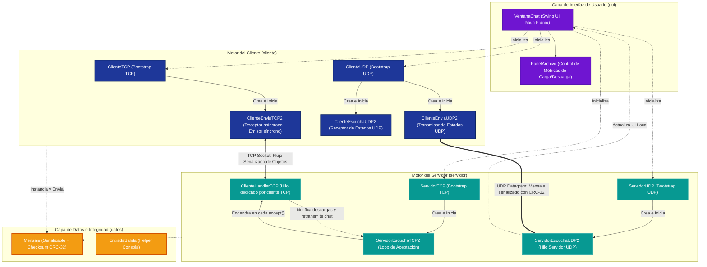
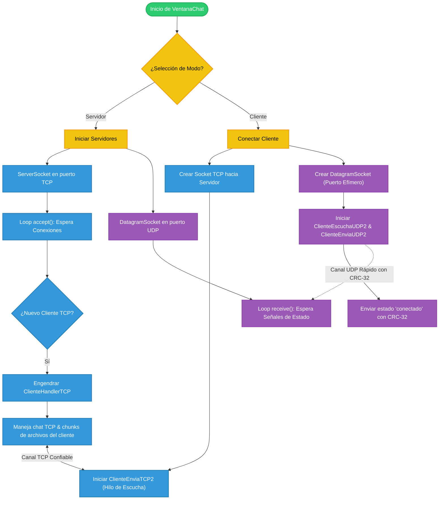
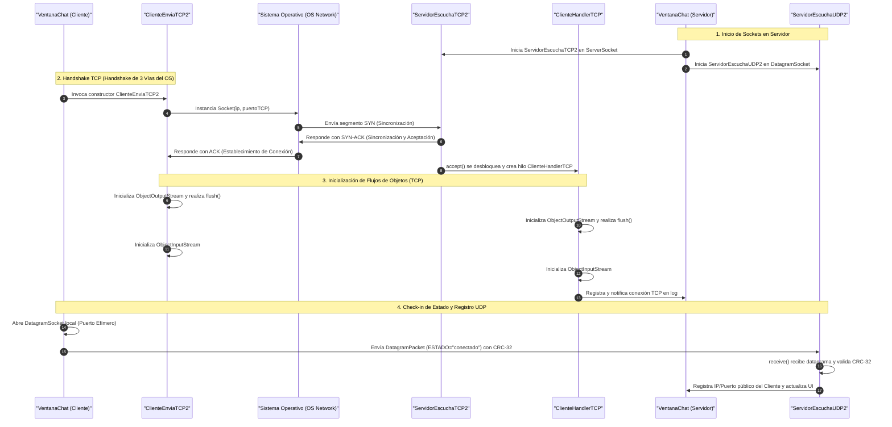

# Arquitectura de la Aplicación de Chat y Transferencia de Archivos (TCP/UDP)

Este documento detalla la arquitectura técnica de la aplicación de mensajería y transferencia de archivos basada en Sockets Java, estructurada bajo un patrón de capas desacopladas que integra de forma simultánea protocolos de red **orientados a conexión (TCP)** y **no orientados a conexión (UDP)** en entornos concurrentes y asíncronos.

---

## 1. Vista General del Sistema

La solución está construida en **Java SE (Swing)** utilizando sockets de red de bajo nivel. Está diseñada para operar de forma híbrida: puede iniciarse como **Servidor** (controlando múltiples hilos de recepción) o como **Cliente** (conectándose de forma interactiva a un servidor remoto).

### Resumen de los Canales de Comunicación:
*   **Canal TCP (Puerto Configurable, por defecto 60000):** Canal confiable utilizado para la transferencia secuencial libre de pérdidas de **mensajes de texto de chat** y **archivos segmentados por chunks**.
*   **Canal UDP (Puerto Configurable, por defecto 60001):** Canal rápido y ligero utilizado para transmitir **notificaciones de estado en tiempo real** (ej. *"escribiendo..."*, *"conectado"*, *"desconectado"*) de forma asíncrona y con validación manual de integridad mediante un checksum **CRC-32**.

---

## 2. Diagrama de la Arquitectura de Capas

El siguiente diagrama en **Mermaid** detalla la descomposición modular del software, organizándolo en capas bien delimitadas: **Capa de Interfaz de Usuario (Presentación)**, **Capa de Red (Controladores de Conexión)** y **Capa de Datos (Modelos y Serialización)**.

---

## 3. Flujo General de Operación del Sistema (Ciclo de Vida)

El ciclo de vida del sistema varía según el modo en el que se inicialice la aplicación (`VentanaChat`). El siguiente diagrama de flujo muestra cómo interactúan los diferentes hilos controladores a nivel lógico cuando se arranca el sistema como Servidor o como Cliente:

---

## 4. Flujo de Establecimiento de Conexión y Handshake (TCP/UDP)

Antes de realizar la comunicación en tiempo real, se establecen y enlazan activamente los canales de red entre los hilos del Cliente y del Servidor. El siguiente diagrama de secuencia describe el proceso detallado, desde el saludo de 3 vías de la pila TCP de sistema operativo hasta el registro de estados por datagramas UDP:

---

## 5. Flujo de Transferencia de Archivos (TCP Chunks)

La transmisión de archivos se implementa dividiendo el flujo físico en bloques exactos de **16 KB (16,384 bytes)** para un balance óptimo entre latencia y throughput de red. Este proceso asíncrono no bloquea la interfaz de usuario de Swing:

```mermaid
sequenceDiagram
    autonumber
    actor U as "Usuario (Cliente)"
    participant VC as "VentanaChat (GUI)"
    participant CE as "ClienteEnviaTCP2"
    participant CH as "ClienteHandlerTCP (Servidor)"
    participant PA as "PanelArchivo (GUI Servidor)"

    U->>VC: Selecciona archivo y presiona "Enviar Archivo"
    VC->>CE: Inicia hilo de envío (enviarArchivo)
    
    rect rgb(30, 30, 40)
        Note over CE, CH: Fase 1: Cabecera (Metadata)
        CE->>CE: Instancia Mensaje(TIPO="ARCHIVO_INICIO", nombre, tamaño)
        CE->>CH: Escribe objeto en ObjectOutputStream y limpia buffer (flush)
        CH->>CH: Crea directorio descargas/ e inicializa FileOutputStream (evita colisión de nombres)
        CH->>PA: Invoca iniciarTransferencia(nombre, totalBytes)
    end
    
    rect rgb(30, 40, 30)
        Note over CE, CH: Fase 2: Segmentación y Transmisión por Chunks
        loop Mientras queden bytes por leer (Buffer de 16 KB)
            CE->>CE: Lee bloque del archivo y extrae chunk exacto
            CE->>CE: Calcula métricas instantáneas (Velocidad bps, Tiempo restante)
            CE->>VC: Actualiza panel de progreso del Cliente
            CE->>CH: Envía Mensaje(TIPO="ARCHIVO_CHUNK", datosArchivo=chunk)
            CH->>CH: Escribe chunk en FileOutputStream y actualiza bytes recibidos
            CH->>CH: Calcula métricas en servidor
            CH->>PA: Actualiza barra de progreso e indicadores visuales
        end
    end

    rect rgb(40, 30, 30)
        Note over CE, CH: Fase 3: Cierre y Confirmación
        CE->>CH: Envía Mensaje(TIPO="ARCHIVO_FIN")
        CH->>CH: Cierra FileOutputStream físicamente
        CH->>PA: Oculta PanelArchivo con temporizador de 5 segundos
        CH->>CH: Instancia Mensaje(TIPO="TEXTO", mensaje="✓ Archivo integrado con éxito")
        CH->>CE: Retransmite confirmación al cliente y chat global
        VC->>U: Muestra log de éxito en el chat general
    end
```

---

## 6. Flujo de Mensajería de Texto en Chat Grupal (TCP Broadcast)

El envío de mensajes de texto ordinarios del chat utiliza sockets orientados a conexión TCP. El cliente emisor escribe el mensaje de texto en la red y lo proyecta inmediatamente en su interfaz de forma local para máxima responsividad. El servidor recibe este mensaje, lo proyecta en su propia pantalla y lo retransmite (*broadcast*) a los demás clientes conectados iterando sobre su lista sincronizada de hilos trabajadores.

```mermaid
sequenceDiagram
    autonumber
    actor U as "Usuario Remitente (Cliente A)"
    participant VCA as "VentanaChat (GUI A)"
    participant CEA as "ClienteEnviaTCP2 (Cliente A)"
    participant SE as "ServidorEscuchaTCP2"
    participant CH as "ClienteHandlerTCP (De Cliente A)"
    participant VCS as "VentanaChat (GUI Servidor)"
    participant CHB as "ClienteHandlerTCP (De Cliente B)"
    participant CEB as "ClienteEnviaTCP2 (Cliente B)"
    participant VCB as "VentanaChat (GUI B)"

    U->>VCA: Escribe texto y presiona "Enviar Mensaje"
    VCA->>CEA: invoca enviarTexto("Remitente", "Hola")
    CEA->>CEA: Instancia Mensaje(TIPO="TEXTO", usuario, mensaje)
    
    rect rgb(30, 40, 30)
        Note over CEA, VCA: Reflejo Local Inmediato
        CEA->>VCA: Invoca agregarLogMensaje() -> Muestra mensaje local
    end
    
    rect rgb(30, 30, 45)
        Note over CEA, CH: Envío al Servidor
        CEA->>CH: Escribe objeto serializado en ObjectOutputStream
        CH->>CH: Deserializa objeto Mensaje
        CH->>VCS: Invoca agregarLogMensaje() -> Muestra en la consola del Servidor
    end
    
    rect rgb(45, 30, 30)
        Note over CH, CEB: Retransmisión (Broadcast)
        CH->>SE: Dispara retransmitirMensaje(msg, origen)
        SE->>CHB: Invoca enviarMensajeObj(msg) (Manejador de Cliente B)
        CHB->>CEB: Escribe objeto serializado en el socket TCP de Cliente B
        CEB->>CEB: Deserializa objeto Mensaje en bucle de escucha
        CEB->>VCB: Invoca agregarLogMensaje() -> Muestra mensaje a Cliente B
    end
```

---

## 7. Flujo de Notificaciones de Estado y Control (UDP con CRC-32 Manual)

Debido a que el protocolo **UDP** no garantiza el orden ni la integridad frente a la pérdida parcial de datagramas, el sistema implementa una **capa manual de consistencia** basada en **CRC-32**:

```mermaid
sequenceDiagram
    autonumber
    participant VC as "VentanaChat (Cliente)"
    participant CE as "ClienteEnviaUDP2"
    participant SE as "ServidorEscuchaUDP2 (Servidor)"
    participant VCS as "VentanaChat (Servidor)"

    VC->>VC: Evento de teclado (Escribiendo...) o cambio de estado
    VC->>CE: Dispara enviarEstado("remitente", "escribiendo")
    CE->>CE: Crea objeto Mensaje(TIPO="ESTADO")
    
    rect rgb(40, 40, 20)
        Note over CE: Cálculo de Checksum Manual
        CE->>CE: calcularChecksum() -> Genera hash CRC-32 sobre (mensaje + tipo + usuario + timestamp)
        CE->>CE: Inyecta checksum en mensaje.setChecksum(crc)
    end
    
    CE->>CE: Serializa objeto a un ByteArrayOutputStream
    CE->>SE: Envía DatagramPacket (Bytes serializados) al puerto UDP
    SE->>SE: Recibe paquete y deserializa bytes a objeto Mensaje
    
    rect rgb(40, 40, 20)
        Note over SE: Verificación de Integridad en Receptor
        SE->>SE: calcula checksumCalculado = msg.calcularChecksum()
        alt checksumRecibido != checksumCalculado
            SE->>VCS: Paquete corrupto detectado. Muestra alerta de integridad y descarta.
        else checksumRecibido == checksumCalculado
            SE->>VCS: Validado correctamente. Invoca actualizarEstadoUdp()
            VCS->>VCS: Muestra "Usuario está escribiendo..." en la barra de estado
        end
    end
```

---

## 8. Descripción Detallada de Componentes y Clases

### A. Capa de Presentación (gui)
*   **`VentanaChat`:** Interfaz gráfica Swing principal diseñada con un tema oscuro contemporáneo. Controla toda la máquina de estados de conexión del chat. Inicia los servidores o clientes de red en hilos secundarios para que la UI se mantenga responsiva (despacho de eventos de Swing por el Event Dispatch Thread - EDT).
*   **`PanelArchivo`:** Componente anidado en la base de la pantalla que se activa únicamente durante las transferencias. Muestra:
    *   *Barra de progreso:* Porcentaje calculado a partir de bytes totales/bytes enviados.
    *   *Velocidad de red:* Expresada de forma dinámica en **bps, Kbps o Mbps** dependiendo de la tasa real.
    *   *Métricas de tiempo:* Registra el tiempo transcurrido (en segundos) y calcula el tiempo restante mediante `(Bytes Restantes) / (Velocidad en Bytes/s)`.

### B. Capa de Datos (datos)
*   **`Mensaje`:** Estructura polimórfica que viaja serializada por la red local. Sus atributos cambian dinámicamente según el campo `tipo` (`"TEXTO"`, `"ARCHIVO_INICIO"`, `"ARCHIVO_CHUNK"`, `"ARCHIVO_FIN"`, o `"ESTADO"`). Contiene la lógica del algoritmo de redundancia cíclica **CRC-32** sobre los campos críticos para la auditoría de paquetes en canales inseguros.
*   **`EntradaSalida`:** Utilidad estática simplificada para imprimir datos formateados en la terminal.

### C. Capa de Red del Cliente (cliente)
*   **`ClienteTCP` / `ClienteUDP`:** Clases cargadoras (Bootstrappers) encargadas de inicializar y estructurar los sockets iniciales asignando puertos y resolviendo direcciones de red.
*   **`ClienteEnviaTCP2`:** Hilo que gestiona la comunicación asíncrona del cliente. Escucha en segundo plano y recibe difusiones del chat. De forma paralela, expone métodos síncronos sincronizados (`synchronized`) sobre el buffer de salida para evitar colisiones en transmisiones concurrentes.
*   **`ClienteEnviaUDP2` / `ClienteEscuchaUDP2`:** Hilos separados encargados de interactuar con el socket de datagramas. Encapsulan el empaquetado y desempaquetado de bytes y la validación matemática de los datagramas recibidos.

### D. Capa de Red del Servidor (servidor)
*   **`ServidorTCP` / `ServidorUDP`:** Clases bootstrap del servidor encargadas de reservar los puertos del sistema operativo.
*   **`ServidorEscuchaTCP2`:** Loop infinito que atiende la primitiva de red `accept()`. Mantiene una lista sincronizada global y robusta de clientes conectados (`Collections.synchronizedList`).
*   **`ClienteHandlerTCP`:** Hilo generado individualmente por cada cliente conectado. Gestiona la recepción de flujos del cliente asignado, decodifica los tipos de paquetes, retransmite la información a los demás clientes en formato broadcast y gestiona la escritura física de archivos en el disco local (`descargas/`).
*   **`ServidorEscuchaUDP2`:** Hilo único servidor de UDP que escucha de forma global notificaciones rápidas de cualquier cliente, asegurando la consistencia mediante validaciones de hash.

---

## 9. Primitivas de Sockets Utilizadas

El sistema hace uso explícito de las primitivas fundamentales del modelo cliente-servidor clásico:

1.  **`LISTEN` (Servidor TCP):** Realizado al instanciar `new ServerSocket(PUERTO_SERVER)`. Reserva el puerto y se prepara para recibir peticiones de conexión.
2.  **`ACCEPT` (Servidor TCP):** Bloqueo pasivo mediante `serverSocket.accept()`. Retorna un objeto `Socket` dedicado al cliente que acaba de negociar la conexión.
3.  **`CONNECT` (Cliente TCP):** Realizado en el constructor de `ClienteEnviaTCP2` al invocar `new Socket(SERVER, PUERTO_SERVER)`. Dispara el handshake de 3 vías con el servidor.
4.  **`SEND` (TCP/UDP):** En TCP, se realiza escribiendo sobre `ObjectOutputStream` (`writeObject()` seguido de `flush()`). En UDP, se realiza enviando datagramas físicos con `socket.send(DatagramPacket)`.
5.  **`RECEIVE` (TCP/UDP):** En TCP, se realiza con el bloqueo de lectura de `ObjectInputStream.readObject()`. En UDP, con la llamada bloqueante de recepción de paquetes `socket.receive(DatagramPacket)`.
